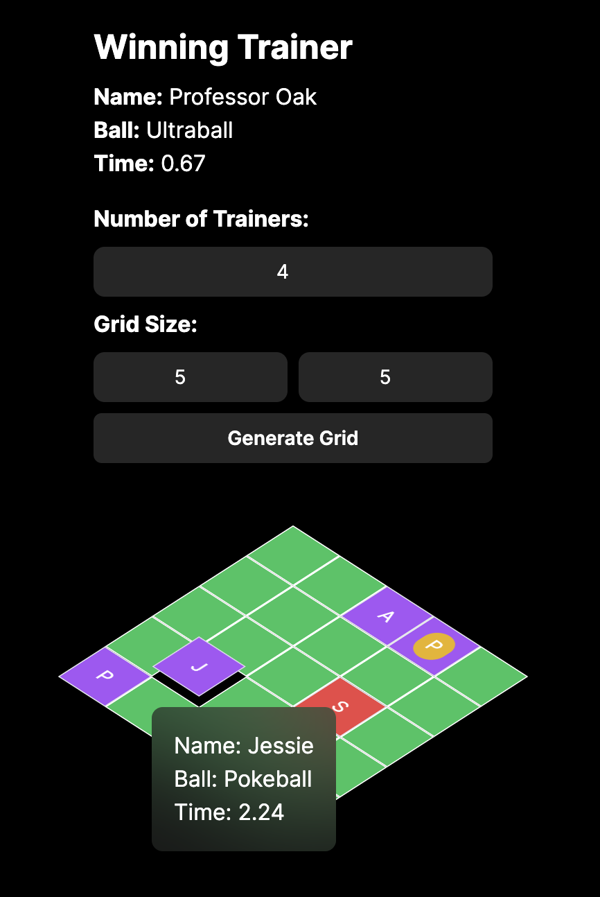

# Catch A Pokemon Game

## Description

A simple simulation to calculate which Pokemon Trainer will catch the Pokemon in a grid. Each Trainer has a randomly
selected Pokeball, and each Pokeball is thrown at different speeds. The first Trainer to reach the Pokemon wins!

The number of Trainers and the grid size can be adjusted in the settings and via the URL query parameters. Hover over
each Trainer in the Grid to see their name, type of ball, and speed.

## Demo
See it live [here](https://catch-a-pokemon-game.vercel.app)!



## Technology

- React
- NextJS
- TailwindCSS
- HeadlessUI

## Installation

```bash
yarn
```

## Getting Started

```bash
yarn start
```

Open [http://localhost:3000](http://localhost:3000) with your browser to see the result.
